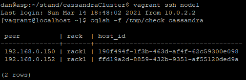

1) Create certificates using 'create_certificates.sh'

2) Run ansible-playbool cassandra_deployment.yml
    to install cassandra
    --tags check_dependencies,install
    to place validation shell script
    --tags validate_sh
      tag 'beta_sh' will run script
    to place validation python script (issues)
    --tags validate_py
      tag 'beta_py' will run script

3) Manual validation can be done with ssh connect to nodes.
    python is in use on node0 by default
    shell is in use on node1 by default

Output example:
Manual shell:

Naming node0, node1, node2 is used in Vafrantfile.
Should be in sync with group_vars/NAME for connection.
