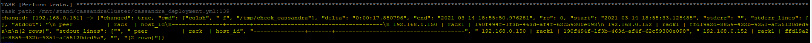
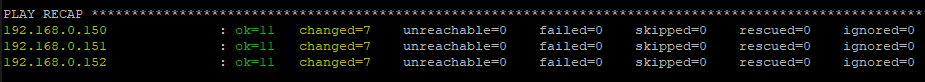

- Create certificates using `create_certificates.sh`
    - set `cassandra` as password
    - change `keystore_password`, `truststore_password` in `cassandra.yaml.j2` when non-standard password is used

- Run `ansible-playbook cassandra_deployment.yml` with below **tags**
    - to prepare environment `--tags check_dependencies`
    - to install cassandra `--tags install`
    - to place validation shell script `--tags validate_sh`
      - better to avoid run on several machines
    - to place validation python script (issues) `--tags validate_py`
    - cassandra version can be changed in task `Ensure cassandra repo is included.`
    - there might be a problem with listning interface set in `cassandra.yaml.j2`

- Manual validation can be done with ssh connect to nodes.
    - python is in use on node0 by default
    - shell is in use on node1 by default

#### Output example:
Manual shell:

Ansible results:

Naming `node0`, `node1`, `node2` is used in Vafrantfile.
Should be in sync with __group_vars/NAME__ for connection.

Complete playbook recap example:

